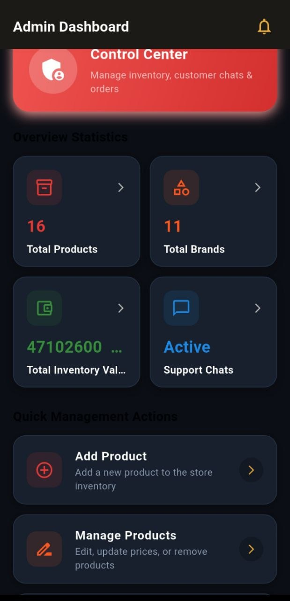
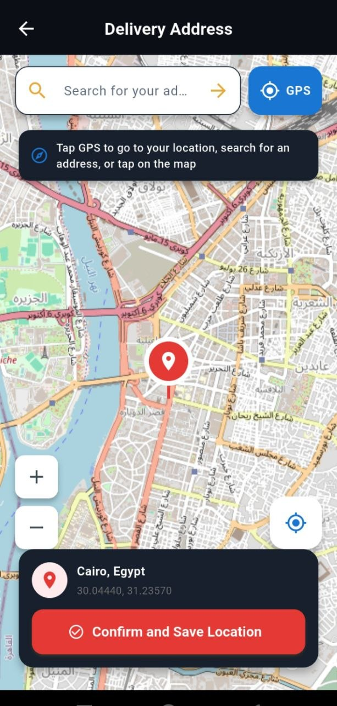
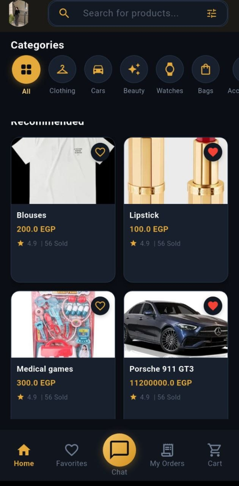

# E-Commerce App

A modern e-commerce mobile application built with Flutter.

## ✨ Features

- User Authentication (Login, Register & Role-based Access)
- Browse & Search Products (Multi-Category Catalog)
- Categories & Product Details
- Cart & Wishlist
- Checkout & Delivery Location Selection
- Order Management & Tracking
- Real-time Chat (Customer & Admin Support)
- Push Notifications (OneSignal & Firebase Cloud Messaging)
- Admin Dashboard
- Product & Order Management
- Interactive Map & Geolocation Tracking (OpenStreetMap)
- On-Device AI Translation & Language Detection (Google ML Kit)
- Multi-Language Support (English & Arabic with full RTL/LTR)
- Cloud Image Uploading & Optimization

## 🛠 Tech Stack

- Flutter & Dart
- BLoC & Cubit (`flutter_bloc`) - State Management
- Cloud Firestore - Database
- Firebase Authentication - Auth Service
- Firebase Storage & Cloudinary - Media & Image Hosting
- Firebase Cloud Messaging (FCM) & OneSignal - Push Notifications
- REST API & HTTP Client (`http`)
- Flutter Map & LatLong2 - Map Integration
- Geolocator & GeoFlutterFire Plus - Geolocation & Distance Calculation
- Google ML Kit - Language Identification & On-Device Translation
- Shared Preferences - Local Key-Value Storage
- Clean Architecture (Data, Domain, Presentation Layers)

## 🏗 Architecture

The project follows Clean Architecture with a feature-based structure
to provide scalability, maintainability, and separation of concerns.

## 📱 Screenshots

<p align="center">
  
  
  
  
  
</p>

## 🚀 Getting Started

```bash
git clone <repository-url>
cd ecommerceapp
flutter pub get
flutter run
```
